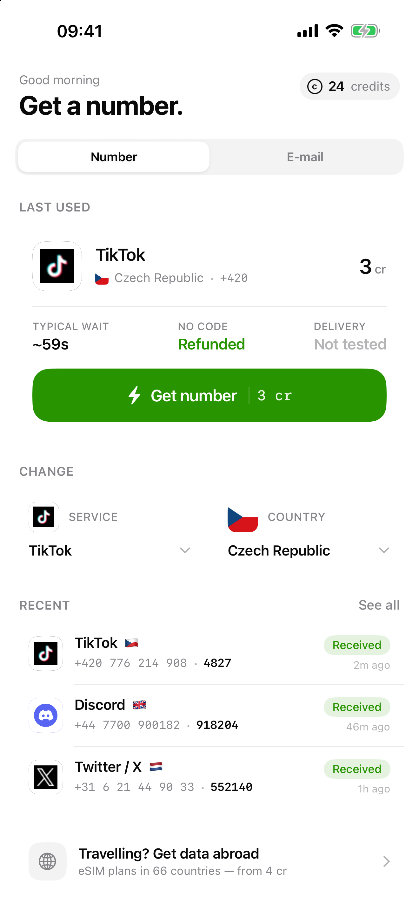
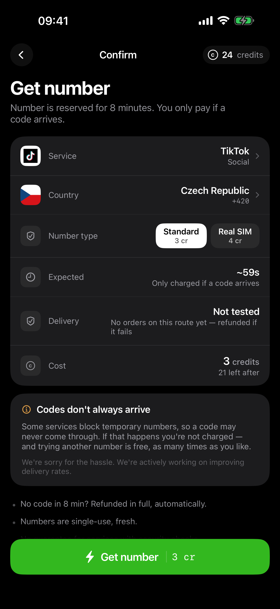

# vSMS

An iOS app that sells **disposable phone numbers, disposable e-mail addresses, and eSIM data plans**, paid for with in-app credits. SwiftUI front end, Supabase back end, and a catalog of several thousand routes that reprices and re-ranks itself every hour against live upstream inventory.

> The Xcode target and scheme are still named `VirtualSIM` — the product was renamed to vSMS after the project was created.

| | | |
|:--:|:--:|:--:|
|  |  |  |
| Home | Checkout | Code delivered |
|  |  |  |
| eSIM store | Waiting for a code | Order history |

---

## What it does

Three product lines share one credit wallet:

1. **Temporary phone numbers** — buy a number for a specific service (WhatsApp, Instagram, Uber…) in a specific country, receive the verification SMS in-app, discard the number. This is the revenue product.
2. **Temporary e-mail addresses** — same shape, on real consumer domains, for services that verify by e-mail.
3. **eSIM data plans** — prepaid travel data, delivered as a QR/LPA profile. *Currently paused at the catalog level while the upstream provider is switched.*

Credits are bought through StoreKit 2 in-app purchases and spent atomically against a Postgres ledger.

---

## Architecture

```
┌──────────────────────────────┐        ┌────────────────────────────────────────┐
│  iOS (SwiftUI, iOS 18+)      │        │  Supabase                              │
│                              │        │                                        │
│  AuthGate                    │        │  Postgres                              │
│    └─ Sign in with Apple     │        │    profiles · wallets · ledger          │
│  ContentView (4 tabs)        │        │    services · countries · routes        │
│    home · esim · orders      │        │    orders · esim_orders · email_orders  │
│    account  + flow covers    │        │    iap_receipts · iap_grants            │
│         │                    │        │    app_config · telegram_events         │
│    APIClient (URLSession)    │        │                                        │
│         ├── REST ────────────┼───────▶│  PostgREST  (catalog, order rows)      │
│         └── RPC  ────────────┼───────▶│  Edge Functions (Deno, 26 of them)     │
│                              │        │    create/check/cancel-order            │
│  AppState (@Observable)      │        │    poll-active-orders  (cron, 1 min)   │
│    single source of truth    │        │    sync-* pricing jobs (hourly/daily)  │
└──────────────────────────────┘        │    iap-verify · register-push · …      │
              ▲                         │                                        │
              │ APNs (token auth, .p8)  │  pg_cron — 16 scheduled jobs           │
              └─────────────────────────│  run_watchdog() — pure SQL monitoring  │
                                        └───────────────┬────────────────────────┘
                                                        │
                             ┌──────────────────────────┼───────────────────────┐
                             ▼                          ▼                       ▼
                    SMS providers              e-mail provider          eSIM provider
              5sim · SMSPVA · HeroSMS             HeroSMS                 SMSPool
                                                                        (paused)
                                                        │
                                                        ▼
                                            Telegram bot — ops alerts,
                                            6-hourly digest, /stats,
                                            /revenue, /orders, support relay
```

**Zero third-party Swift dependencies.** The app builds against the iOS SDK alone, which is why a single `swiftc -typecheck` over every source is a valid whole-app check.

---

## The interesting parts

Most of this repo's complexity isn't the CRUD — it's four problems that turned out to be harder than they look.

### 1. Multi-provider routing with no silent fallback

The catalog is one row per `(service, country)` in `routes`, with `provider` as a column. `_shared/providers.ts` is the **single source of truth** for which upstream fills an order; order and polling functions call the router, never a provider directly.

Routing resolves the route's recorded owner **first**. This matters because a route can carry credentials for two providers at once, and the provider that *priced* a row must be the one that *buys* it — otherwise the margin check compares one provider's cost against another's price list and refuses honest orders.

There is deliberately **no cross-provider fallback**. A stockout fails as a stockout rather than silently re-reserving somewhere else at a different price and delivery profile. Every provider adapter must also classify its own faults (`OUT_OF_STOCK` vs `AUTH_ERROR` vs rate limit); an adapter that doesn't collapses "our account is dead" into "try another country".

### 2. Steering on evidence, and never conflating two kinds of it

The app ranks routes by what's actually known about them, in tiers:

```
proven delivering  →  untested w/ rated pool  →  untested & unrated
                   →  untested w/ pool reported dead  →  measured failing
```

Two rules hold this together:

- **Our measurement and the vendor's are never mixed.** `routes.success_*` is our own record of orders we placed and is the only thing rendered as a delivery claim ("Worked 3 of 7 times", never a bare percentage off a tiny sample). A provider's published rate is *steering input only* — it describes their inventory across all their customers, not our outcomes.
- **Absent ≠ zero.** A missing rate means "never measured" and sorts neutrally; an explicit zero means "measured and it failed" and sorts last. Collapsing the two condemns every low-traffic route in the catalog — and the inverse, trusting a stale 30-day rate, pins pools that died a week ago.

Evidence is also **scoped to the provider that will serve the next order**. After a provider switch the catalog's measured history correctly goes quiet and rebuilds, because a route ID is not a provider.

### 3. Money paths that survive a killed worker

Every credit movement is designed around the assumption that the process can die mid-flight.

- **Charge and order row are one transaction.** `begin_order()` does dedupe + insert + charge under a per-user advisory lock. An earlier design charged first and inserted after the upstream reservation succeeded, which left every failure as a spend pointing at nothing.
- **Status transitions are atomic claims.** Every write is conditional on the current status plus a row-count check, so a terminal state can't be overwritten by a slower worker.
- **A status claim and its refund are the same transaction**, never two round-trips — a worker killed between them would leave a terminal row whose charge is never returned, and the expiry sweeps only revisit open rows.
- **Every credit grant is tombstoned outside the `auth.users` cascade.** Apple mandates a Delete Account button, so anything keyed to a user ID can be farmed by deleting and re-registering. Grants are recorded in tables with no foreign key to the user.
- **Apple receipts are verified by chaining to a pinned root.** The full `x5c` chain is walked and must terminate at Apple's root CA matched by SHA-256 thumbprint, with credits granted only for `Production` transactions.

### 4. A catalog that corrects itself, and monitoring that survives an outage

Hourly jobs re-price every route from live upstream quotes, hide what can't be served, and recompute delivery evidence. Cost smoothing is a **ratchet** — a price rise applies immediately, only falls are averaged — because a symmetric moving average sets retail *below* what you are about to pay.

Monitoring is `run_watchdog()`, deliberately **plain SQL on pg_cron**: no edge function, no shared secret, no HTTP. It checks job freshness, delivery collapse and failed background requests, and writes a verdict a Telegram bot turns into pages. Because it depends on none of the application layer, it still evaluates when the application layer is what's broken.

---

## Repo layout

```
VirtualSIM/                 iOS app — 95 Swift sources, no SwiftPM deps
                            (+ Secrets.swift, gitignored, you create it)
  Auth/                     Sign in with Apple, Keychain-backed session
  Networking/               APIClient + per-resource APIs (Secrets.swift is gitignored)
  State/AppState.swift      Single @Observable source of truth: catalog, orders,
                            wallet, checkout/flow machine, all steering rules
  Models/                   Codable structs mirroring DB columns (snake_case)
  Screens/                  Home, Checkout, Waiting, OTP, Orders, Account,
                            eSIM flow, Recovery, e-mail flow, support chat
  Sheets/ Components/       Pickers, credit sheet, logos, flags, delivery badges
  DesignSystem/             Theme, typography, motion vocabulary, Liquid Glass
  Localizable.xcstrings     en source + de/es/fr/it/ja/pt-BR

supabase/
  functions/                26 Deno edge functions
    _shared/                13 modules — provider adapters, APNs, IAP chain
                            verification, Telegram, CORS, admin client
  migrations/               138 chronological SQL migrations

docs/                       Runbooks, App Store listing copy, legal pages, ASO study
scripts/                    Asset fetching, vendor data collection
screenshots/                Light and dark captures of every major screen
CLAUDE.md                   Engineering notes — the long-form "why", including
                            every bug that shaped the decisions above
```

`CLAUDE.md` is the real design document. It is written as a warning log rather than a tutorial: nearly every rule in it exists because the opposite was tried first and broke something in production.

---

## Getting started

**Requirements:** Xcode 26+, an iOS 18.0+ simulator or device, the Supabase CLI, and a Supabase project.

```bash
# 1. Client secrets (gitignored — create it by hand)
cat > VirtualSIM/Networking/Secrets.swift <<'SWIFT'
enum Secrets {
    static let supabaseURL     = "https://<project-ref>.supabase.co"
    static let supabaseAnonKey = "sb_publishable_..."
}
SWIFT

# 2. Type-check the whole app without a simulator
xcrun swiftc -typecheck \
  -sdk "$(xcrun --sdk iphonesimulator --show-sdk-path)" \
  -target arm64-apple-ios26.5-simulator -swift-version 5 \
  $(find VirtualSIM -name '*.swift')

# 3. Or build for real (catches resource and Info.plist problems type-checking can't)
xcodebuild -project VirtualSIM.xcodeproj -scheme VirtualSIM \
  -configuration Debug -sdk iphonesimulator \
  -destination 'platform=iOS Simulator,name=iPhone 17 Pro,OS=26.5' build
```

Backend deployment, required secrets, and the cron schedule are documented in [`supabase/README.md`](supabase/README.md).

There is **no automated test suite** — verification is a type-check plus a real build for the client, and for the backend a redeploy followed by querying the resulting database state. Several past bugs looked identical to success until a row was actually read back.

---

## Notes

- **Minimum iOS is 18.0.** Anything behind an `if #available(iOS 26, *)` must keep a working 18.0 path — the majority of devices only ever render the fallback.
- **The publishable Supabase key is safe in client code.** It's the anon key under its current name; row-level security governs what it can reach.
- **`docs/apidocs.pdf`** is a third-party vendor's API specification, kept for reference. It is not covered by this repository's licence.
